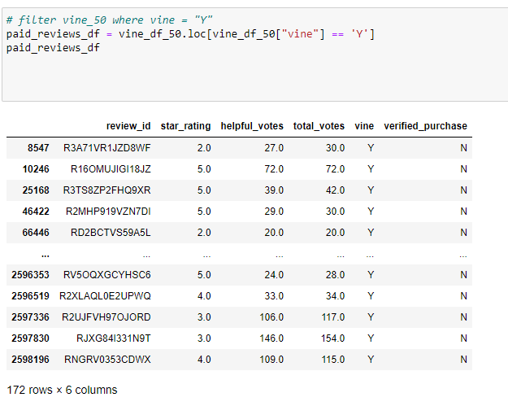
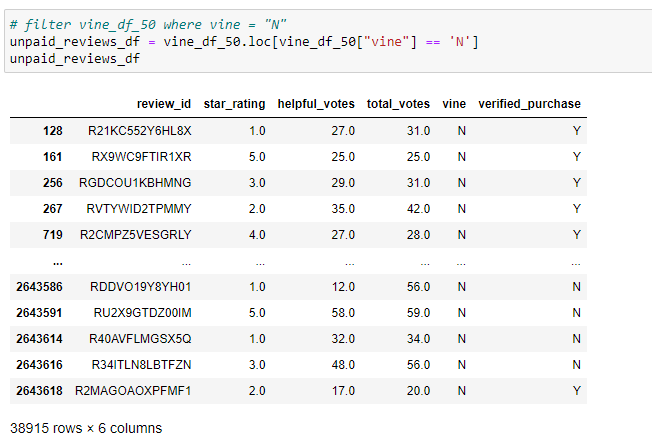
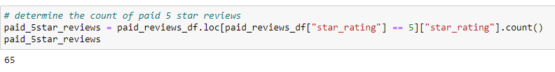
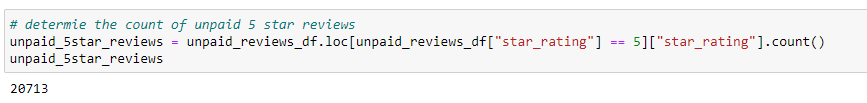
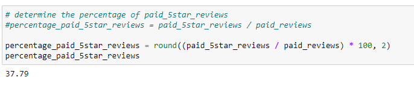
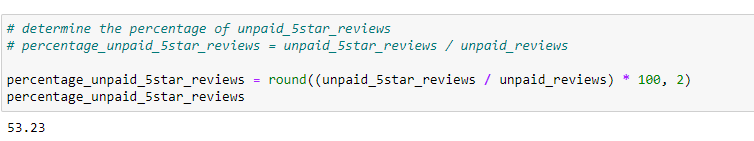

# Amazon_Vine_Analysis

## Overview

This analysis was performed on a datset of Amazon reviews encompassing pet products in order to examine the realtionship between paid and unpaid reviews. Reviews are written by members of the Amazon VINE program. These members specialize in insightful reviews in order to give Amazon's customers more information on which to make a purchase. More information about VINE can be found [here](https://www.amazon.com/vine/about)

## Software

- Pandas
- pgAdmin
- Google Colab Notebook
- Amazon Web Services (AWS)

## Results

There were 172 Vine reviews

There were 38,915 non-Vine reviews

There were 65 five star Vine reviews

There were 20,713 five star non-Vine reviews

37.19% of the Vine reviews were five star

53.23% of the non-Vine reviews were five star

## Summary

By looking at the data there is reason to beleive that a bias does not exist between paid (Vine) and unpaid (non-Vine) reviews. 37.19% of the Vine reviews were five star while 53.23% of the non-Vine reviews were five star. 

To further this analysis, we could also include the ratings from one star through four stars to see if that trend continues to hold true. Are Vine reviewers easier or harder on the product if they are not up to five star standards? How do non-Vine reviewers fare?

